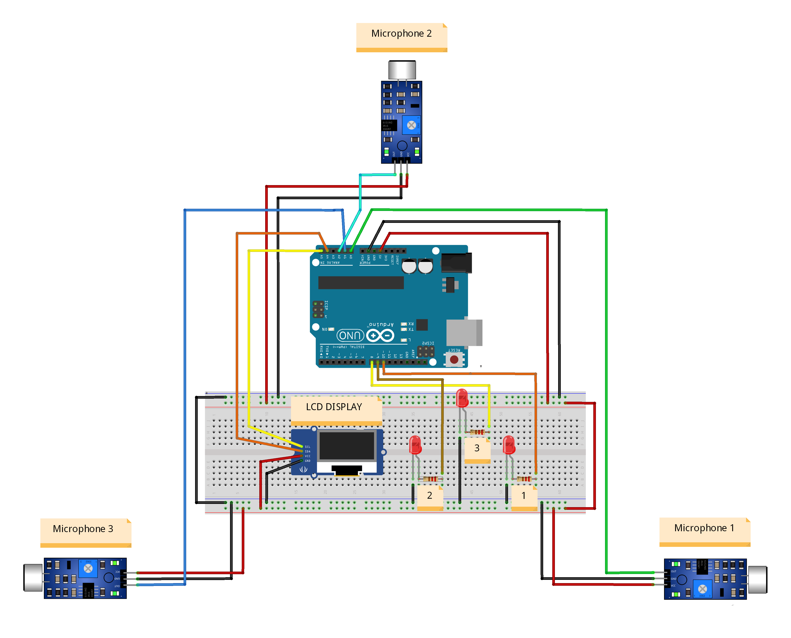

# Localization and tracking of moving targets by microphones
 
Implementation a sound triangulation system using three microphones to locate the source of a sound. 

#### Purpose

The code defines the pins for each microphone and their positions in space, then initializes the serial communication and sets the pins as input. In the loop, the code reads the analog values from each microphone, calculates the time delay between them, and then the time difference of arrival (TDOA) for each pair of microphones. Using triangulation, the code then calculates the x and y coordinates of the sound source and prints them to the serial monitor. Calculate the distance between the sound source and each microphone using the Pythagorean theorem.

#### Language
Implementation in Arduino and Matlab

#### Wiring 

#### Setup 

#### Plugins and others

| Plugins             | Source                                                                 |
| ----------------- | ------------------------------------------------------------------ |
| Matlab | https://www.mathworks.com/products/matlab.html |
| Arduino | https://www.arduino.cc/ |
| LM393 Microphone Sound Sensor | https://components101.com/modules/lm393-sound-detection-sensor-module |
| Interface OLED Graphic Display Module | https://microcontrollerslab.com/oled-display-arduino-tutorial/ |
| 5mm LED Light | https://www.ledsupply.com/5mm-leds |

## 🚀 About Me
I'm a full stack developer...

Author: Hemant Ramphul  
[ LinkedIn](https://www.linkedin.com/in/hemantramphul/)
&nbsp;
[ GitHub](https://github.com/hemantramphul/)
Date: 05 May 2023  

<h1 align='center'>
  Hi there 👋 I'm Hemant 👨‍💻
</h1>

  A full stack developer from Mauritius. 

  
  &nbsp;&nbsp;
  &nbsp;&nbsp;
  

  

___

##### Université des Mascareignes (UdM)
Faculty of Information and Communication Technology  
Master Artificial Intelligence and Robotics  
Official Website: https://udm.ac.mu  

**Free Software, Source Code, Enjoy!** 👋
